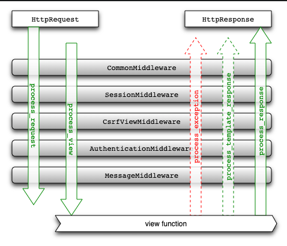

# Django Interview

## Basics


**Q What is django? What do you like about it (Can be re-phrased as what are the features of django?)**

Ans - Django is a high-level Python web framework that encourages rapid development and clean, pragmatic design.

Features : 

- Admin Interface (CRUD)
- Templating
- Form handling
- Internationalization
- Session, user management, role-based permissions
- Object-relational mapping (ORM)
- Testing Framework
- Fantastic Documentation
- Open Source and huge collection of availbale packages

Benefits :

*Speed:* Its slogan is ‘The Web framework for perfectionists with deadlines‘, so it is focused on web-dev tasks made fast. Django was created with the helpful mindset of allowing devs to realize ideas as quickly as possible, with less code.

*Security:* Avoid common security mistakes with its user authentication system and secure password management.

*Scalable:* Meet heavy traffic demands with its “shared-nothing” architecture. Add hardware at any level, including database servers.

*Out of the box features:* Without any extra downloads, Django handles user authentication, content administration, site maps, RSS feeds, and more.


**Q. What is the architecture that django follows?**

Ans - Django follows the Model-Template-View (MTV) architecture. There is separation of concerns between the database interfacing classes (Model), request-processing classes (View), and a templating language for the final presentation (Template).

**Q. What is the latest version of Django and which one you are uisng?**

Ans - The latest version of django is, Django - 3.0. I am using Django 2.2 which is LTS (Long term support) release.


**Q. Is django an MVC framework?**

Ans - Django follows MVC pattern very closely but it uses slightly different terminology. Django is essentially an MTV (Model-Template-View) framework. Django uses the term Templates for Views and Views for Controller. In other words, in Django views are called templates and controllers are called views. Hence our HTML code will be in templates and Python code will be in views and models.


**Q. What popular websites use django? Can you name some?**

Ans Disqus, Instagram, Mozilla, NASA, The Washington Post etc.

**Q. How is Django’s code reusability feature different from other frameworks?**

Ans. Django framework offers more code-reusability then other frameworks out there. As Django Project is a collection of different applications like login application, signup application. These applications can be just copied from one directory to another with some tweaks to settings.py file and you won’t need to write new signup application from scratch.

That’s why Django is a rapid development framework and this level of code reusability is not there in other frameworks.

**Q. Explain the file structure of a typical Django project?

Ans. A Django project is a collection of web-applications which coordinate together to serve the request of the user. These applications have one assigned feature and shall do only that.

A typical Django project consists of these four files:


|── manage.py <br />
└─┬ ProjectFolder <br />
  ├── settings.py <br />
  ├── __init__.py <br />
  ├── urls.py <br />
  └─┬ wsgi.py <br />


The last four files are inside a directory, which is at the same level of manage.py.

Here the structure is very logical, and the names of these files and their purpose should remain intact.

*manage.py* is the command line utility of your Django project and this file is used to control your Django project on the server or even to begin one.

When Django server is started, the manage.py file searches for *settings.py* file, which contains information of all the applications installed in the project, middleware used, database connections and path to the main urls config.

The *urls.py* file is like a map of your whole web-project, this file examines URL and calls the right view function or transports the URL to another application specific urls-config file. This is like the main URL linker and any app installed in the *settings.py* which you wish to be searched by the URL should have a link here.

The *__init__.py* file is an empty file which is there to make the python interpreter understand that the directory consisting *settings.py* is a module/ package.

The *wsgi.py* file is for the server format WSGI, which Django supports natively. We can customize that for other server formats.

**Q. What happens when a typical Django website gets a request? Explain.**

Ans. When a user enters a URL in the browser the same request is received by the Django Server. The server then looks for the match of the requested URL in its URL-config and if the URL matches, it returns the corresponding view function. It will then request the data from the Model of that application, if any data is required and pass it to the corresponding template which is then rendered in the browser, otherwise, a 404 error is returned.


**Q. Why is Django called loosely coupled framework?**

Ans. Django is called a loosely coupled framework because of the MTV architecture it’s based on. Django’s architecture is a variant of MVC architecture and MTV is useful because it completely separates server code from the client’s machine.

Django’s Models and Views are present on the client machine and only templates return to the client, which are essentially HTML, CSS code and contains the required data from the models.

These components are totally different from each other and therefore, front-end developers and backend developers can work simultaneously on the project as these two parts changing will have little to no effect on each other when changed.

Therefore, Django is called a loosely coupled framework.

**Q. Explain the importance of settings.py file and what data/ settings it contains.**

Ans. When Django server starts, it first looks for settings.py. As the name settings, it is the main settings file of your web application. Everything inside your Django project like databases, backend engines, middlewares, installed applications, main URL configurations, static file addresses, templating engines, allowed hosts and servers and security key stores in this file as a list or dictionary.

So, when your Django server starts it executes settings.py file and then loads particular engines and databases so that when a request is given it can serve the same quickly.


**Q. Explain how you can set up the Database in Django?**

Ans - You can use the command edit mysite/setting.py , it is a normal python module with module level representing Django settings.

```python
DATABASES = {
    'default': {
        # 'ENGINE': 'django.db.backends.sqlite3',
        # 'NAME': os.path.join(BASE_DIR, 'db.sqlite3'),
        # 'OPTIONS': {
        #    'timeout': 20,
        # }
        'ENGINE': 'django.db.backends.postgresql',
        'NAME': 'name_of_database',
        'USER': 'postgres',
        'PASSWORD': 'password',
        'HOST': 'localhost',
        'PORT': 5432,
        
    }
}
```

Django uses SQLite by default; it is easy for Django users as such it won’t require any other type of installation. In the case your database choice is different that you have to the following keys in the DATABASE ‘default’ item to match your database connection settings

Engines: you can change database by using ‘django.db.backends.sqlite3’ , ‘django.db.backeneds.mysql’, ‘django.db.backends.postgresql_psycopg2’, ‘django.db.backends.oracle’ and so on
Name: The name of your database. In the case if you are using SQLite as your database, in that case database will be a file on your computer, Name should be a full absolute path, including file name of that file.
If you are not choosing SQLite as your database then setting like Password, Host, User, etc. must be added.

**Q. What is Django ORM?**

Ans. Django ORM is one of the special feature-rich tools in Django. ORM is an acronym for Object-Relational Mapper. This ORM enables a developer to interact with a database in a pythonic way.

Django ORM is the abstraction between models (web application data-structure) and the database where the data is stored. It makes possible to retrieve, save, delete and perform other operations over the database without ever writing any SQL code.

It also covers many loopholes and takes all the field attributes and gives you more control over your code in Python rather than any database language.


**Q. Mention what does the Django templates consists of? How does Django Templating work?**

Ans - The template is a simple text file.  It can create any text-based format like XML, CSV, HTML, etc.  A template contains variables that get replaced with values when the template is evaluated and tags (% tag %) that controls the logic of the template.

Django templating engine handles templating in the Django framework. There are some template syntaxes which declares variables, control logic, filters, and comments. After putting these inside the HTML structure, when the web page is requested and called upon by the view function, the Django Template engine gets two things, the HTML structure with variables in place and the data to replace with those variables. It replaces the variables with data while also executing the control logic and generating filters. It renders the required HTML and sends it to the browser when all the work gets complete.

**Q. Explain the use of session framework in Django?**

Ans - In Django, the session framework enables you to store and retrieve arbitrary data on a per-site-visitor basis.  It stores data on the server side and abstracts the receiving and sending of cookies.  Session can be implemented through a piece of middleware.

**Q. Explain the migration in Django and how you can do in SQL?**

Ans - Migration in Django is to make changes to your models like deleting a model, adding a field, etc. into your database schema.  There are several commands you use to interact with migrations.

Migrate
Makemigrations
Sqlmigrate
To do the migration in SQL, you have to print the SQL statement for resetting sequences for a given app name.

```python
./manage.py sqlsequencreset
```

Use this command to generate SQL that will fix cases where a sequence is out sync with its automatically incremented field data.


**Q. What is Unicode, what is UTF-8 and how do they relate?**

Ans - Unicode is an international encoding standard that works with different languages and scripts. It consists of letters, digits or symbols representing characters from across the world. UTF-8 is a type of encoding, a way of storing the code points of Unicode in a byte form, so you can send Unicode strings over the network or store them in files.”


**Q. List out the inheritance styles in Django?**

Ans - In Django, there is three possible inheritance styles

*Abstract base classes:* This style is used when you only wants parent’s class to hold information that you don’t want to type out for each child model.

*Concrete/Multi-table Inheritance:* Concrete inheritance works by deriving from the base class just like you normally would in Python classes. However, in Django, this base class will be mapped into a separate table. Each time you access base fields, an implicit join is needed. This leads to horrible performance.

*Proxy models:* You can use this model, If you only want to modify the Python level behavior of the model, without changing the model’s fields


## Intermediate

**Q. What is WSGI?**

Ans - Django, being a web framework, needs a web server in order to operate. And since most web servers don’t natively speak Python, we need an interface to make that communication happen. This is where WSGI comes.

WSGI is the main Python standard for communicating between Web servers and applications, but it only supports synchronous code.

Example of WSGI servers - uWSGI, Guniocrn etc

**Note** - Django begins its path towards asynchronous code capability. With djnago 3.0, it now supports running as an ASGI (Asynchronous Server Gateway Interface) application. ASGI provides an interface between asynchronous Python web servers and frameworks.

This is major benefit for web programming. Instead of running 10 queries one after the other and waiting for each one to come back, you can run 10 queries at the same time, while hitting your cache and making a HTTP request simultaneously on a single thread.


**Q. What are fixtures?**

Ans - it’s sometimes useful to pre-populate your database with hard-coded data when you’re first setting up an app. You can provide initial data with fixtures.

As an example, though, here’s what a fixture for a Person model might look like in JSON:
```json
[
  {
    "model": "myapp.person",
    "pk": 1,
    "fields": {
      "first_name": "John",
      "last_name": "Lennon"
    }
  },
  {
    "model": "myapp.person",
    "pk": 2,
    "fields": {
      "first_name": "Paul",
      "last_name": "McCartney"
    }
  }
]
```
You can load data by calling 
```python
manage.py loaddata <fixturename>
```


**Q. Middlewares - what they are and how they work?**

Ans - Middlewares are hooks to modify Django request or response object. It’s a light, low-level “plugin” system for globally altering Django’s input or output.

You can use middleware if you want to modify the request i.e HttpRequest object which is sent to the view. Or you might want to modify the HttpResponse object returned from the view.

Example - SecurityMiddleware, SessionMiddleware, AuthenticationMiddleware etc...



An example middleware
```python
class BookMiddleware(object):
	def process_request(self, request):
		print "Middleware executed"
```
Add this middleware in MIDDLEWARE_CLASSES

```python
MIDDLEWARE_CLASSES = (
	'books.middleware.BookMiddleware',
  ...
)
```
Make request to any url. This should get printed on runserver console

```python
Middleware executed
```

**Q. What are decorators? Name some useful built-in django decorators.

Ans - By definition, a decorator is a function that takes another function and extends the behavior of the latter function without explicitly modifying it.

Example: 
```python
from django.core.exceptions import PermissionDenied

def login_required(function):
    def wrap(request, *args, **kwargs):
        user = request.user
        if user.is_authenticated():
            return function(request, *args, **kwargs)
        else:
            raise PermissionDenied
    wrap.__doc__ = function.__doc__
    wrap.__name__ = function.__name__
    return wrap
```

Some useful built-in decorators

**login_required**

**group_required:** allow a certain group of users to access a page.

```python
@group_required(‘admins’, ‘seller’)
def my_view(request, pk)
```

**ajax_required:** checks if the request is an AJAX request.

**timeit:** This decorator is very helpful if you need to improve the response time of one of then our views or if you just want to know how long it takes to run.


**Q. What are mixins?? Name some useful built-in django mixins.

Ans - Python supports a simple type of multiple inheritence which allows the creation of Mixins, which are sort of class that is used to mix-in extra properties and methods into a class.This allows you to create class in a compositional style.

Example:
```python
class Mixin1(object):
    def test(self):
        print "Mixin1"

class Mixin2(object):
    def test(self):
        print "Mixin2"

class MyClass(Mixin2, Mixin1, BaseClass):
    pass
```
*Note*: In Python, the class hierarchy is defined right to left.


**Q. What is signals and how to use it? What are two important parameter in signals?**

Ans - Signals allow certain senders to notify a set of receivers that some action has taken place. They’re especially useful when many pieces of code may be interested in the same events.

Some of the most used models’ signals are the following:

- *pre_save/post_save:* This signal is thrown before/after the method save().

- *pre_delete/post_delete:* Before after delete a model’s instance (method delete()) this signal is thrown.

- *pre_init/post_init:* This signal works before/after instantiating a model (__init__() method)

**Connecting Signals**

With the @receiver decorator, we can link a signal with a function:

```python
from django.db.models.signals import post_save
from django.dispatch import receiver
from someapp.models import MyModel

@receiver(post_save, sender=MyModel)
def my_function_post_save(sender, **kwargs):
   # do the action…
```

Every time that a MyModel’s instance ends to run its save() method, the my_function_post_save will start to work.


**Q. How will you integrate a legacy database in your django project?**

Ans - First, You’ll need to tell Django what your database connection parameters are, and what the name of the database is. Do that by editing the DATABASES setting and assigning values to the following keys for the 'default' connection.

Django comes with a utility called inspectdb that can create models by introspecting an existing database. Create models.py file based on output of same command

```python
$ python manage.py inspectdb > models.py
```

Q. How you will add extra function/feature in admin part?
Ans - To do so, modify admin.py file in the app directory to include your model and fields that you wnat to appear inside admin pannel.

Example - 
*models.py*
```python
from django.db import models
Rating = [
    ('b', 'Bad'),
    ('a', 'Average'),
    ('e', 'Excellent')
]
#DataFlair
class Product(models.Model):
    name = models.CharField(max_length = 200)
    description = models.TextField()
    mfg_date = models.DateTimeField(auto_now_add = True)
    rating = models.CharField(max_length = 1, choices = Rating)
    def __str__(self):
        return self.name
    def show_desc(self):
        return self.description[:50]
```

*admin.py*

```python
from django.contrib import admin
from django.contrib.auth.models import Group
from .models import Product

# Admin Action Functions
def change_rating(modeladmin, request, queryset):
    queryset.update(rating = 'e')

# Action description
change_rating.short_description = "Mark Selected Products as Excellent"

class ProductA(admin.ModelAdmin):
    list_display = ('name', 'description', 'mfg_date', 'rating')
    list_filter = ('mfg_date', )
    actions = [change_rating]

admin.site.register(Product, ProductA)
admin.site.unregister(Group)

# changes the header of admin
admin.site.site_header = "Django Interview Example"
```

**Q Mentions steps to deploy static files on your production server.**

Ans - *Serving the site and your static files from the same server:*

- Push your code up to the deployment server.

- On the server, run collectstatic to copy all the static files into STATIC_ROOT.

- Configure your web server to serve the files in STATIC_ROOT under the URL STATIC_URL.

*Serving the site and your static files from dedicated server*

Since your static file server won’t be running Django, you’ll need to modify the deployment strategy to look something like:

- When your static files change, run collectstatic locally.
- Push your local STATIC_ROOT up to the static file server into the directory that’s being served. rsync is a common choice for this step since it only needs to transfer the bits of static files that have changed.

*Serving static files from a cloud service or CDN:*

There’s any number of ways you might do this, but if the provider has an API, you can use a custom file storage backend to integrate the CDN with your Django project. If you’ve written or are using a 3rd party custom storage backend, you can tell collectstatic to use it by setting STATICFILES_STORAGE to the storage engine.

For example, if you’ve written an S3 storage backend in myproject.storage.S3Storage you could use it with:

```python
STATICFILES_STORAGE = 'myproject.storage.S3Storage'
```
Once that’s done, all you have to do is run collectstatic and your static files would be pushed through your storage package up to S3. If you later needed to switch to a different storage provider, you may only have to change your STATICFILES_STORAGE setting.

For detail on writing custom storage system, [see](https://docs.djangoproject.com/en/3.0/howto/custom-file-storage/)

**Q. What is Jinja Templating?**

Ans. Django supports many popular templating engines and by default, it comes with one very powerful templating engine. Jinja Templating is a very popular templating engine for Python, the latest version in the market is Jinja 2.
There are some features of Jinja templating which makes it a better option then the default template system in Django.

Sandbox Execution – This is like a sandbox or a protected framework for automating the testing process.
HTML Escaping – Jinja 2 provides automatic HTML Escaping, as <, >, & characters have special values in templates and if used as regular text, these symbols can lead to XSS Attacks which Jinja deals with automatically.
Template Inheritance
Generates HTML templates much faster than default engine
Easier to debug, compared to default engine.


## Advanced

Q. How will you get list of logged-in users?

Ans - For this, you can query the Session model for non-expired sessions, then turn the session data into users.

```python
from django.contrib.auth.models import User
from django.contrib.sessions.models import Session
from django.utils import timezone

def get_all_logged_in_users():
    # Query all non-expired sessions
    # use timezone.now() instead of datetime.now() in latest versions of Django
    sessions = Session.objects.filter(expire_date__gte=timezone.now())
    uid_list = []

    # Build a list of user ids from that query
    for session in sessions:
        data = session.get_decoded()
        uid_list.append(data.get('_auth_user_id', None))

    # Query all logged in users based on id list
    return User.objects.filter(id__in=uid_list)
```


*Sources*
[Understanding django middleware](https://www.agiliq.com/blog/2015/07/understanding-django-middlewares/) <br />
[list of logged-n users](https://stackoverflow.com/questions/2723052/how-to-get-the-list-of-the-authenticated-users) <br />
[Understanding Django Signals](https://www.bedjango.com/blog/understanding-django-signals/) <br />


